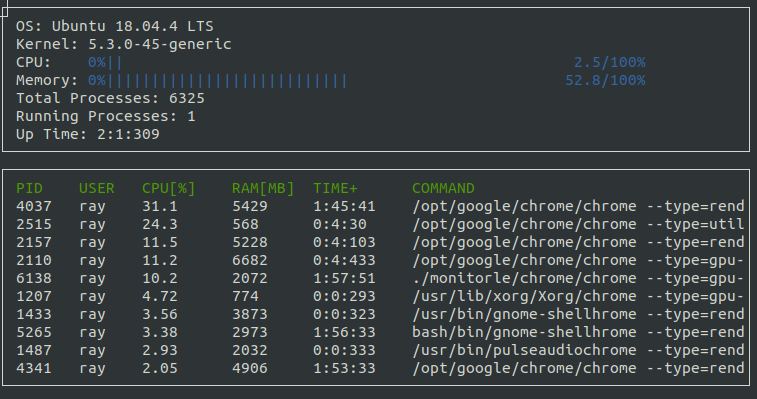

# System Monitor

## ncurses
[ncurses](https://www.gnu.org/software/ncurses/) is a library that facilitates text-based graphical output in the terminal. This project relies on ncurses for display output.

Install ncurses within your own Linux environment: `sudo apt install libncurses5-dev libncursesw5-dev`

## Instructions

1. Clone the project repository: `git clone https://github.com/YuanRayChang/System-Monitor.git`

2. Make a build directory: `mkdir build && cd build`

3. Build: `cmake .. && make`

4. Execute: `./monitor`